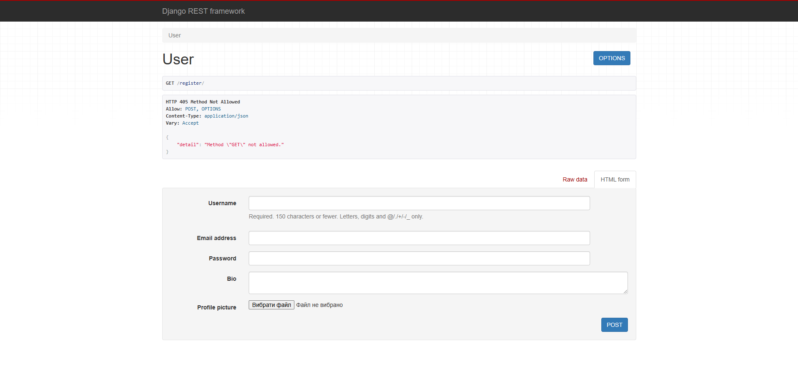
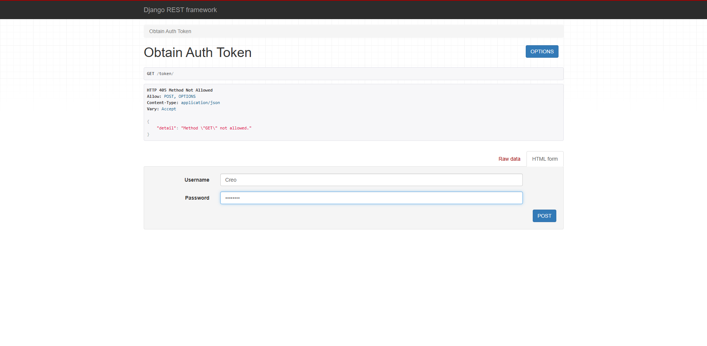
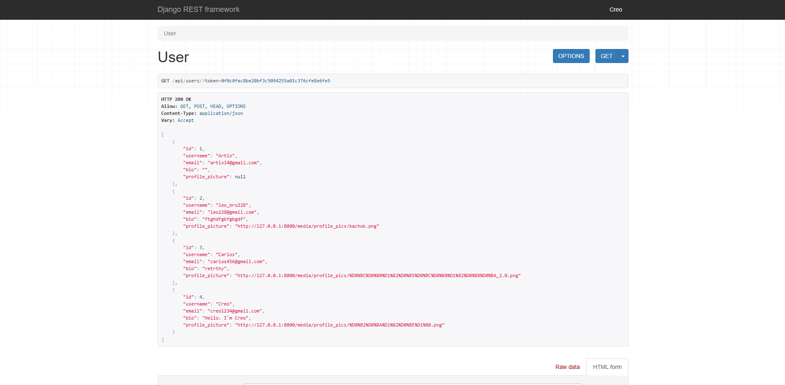
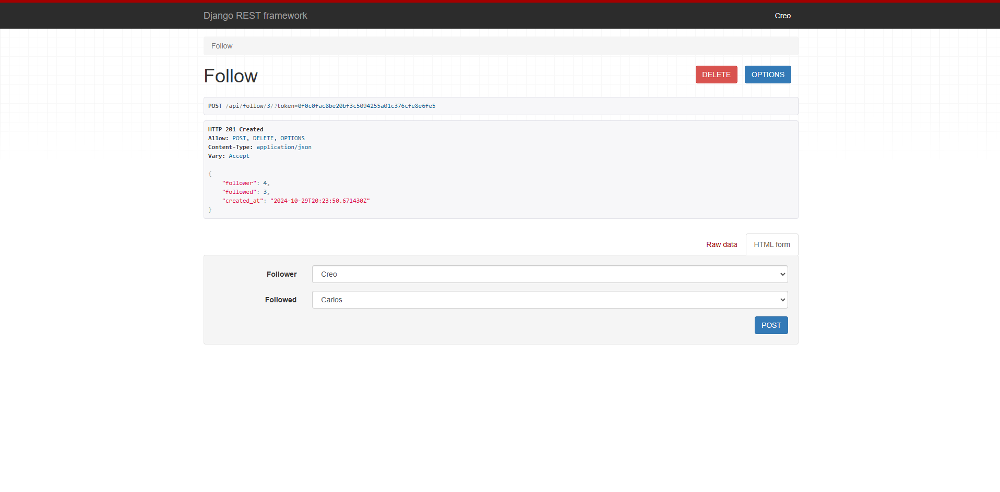
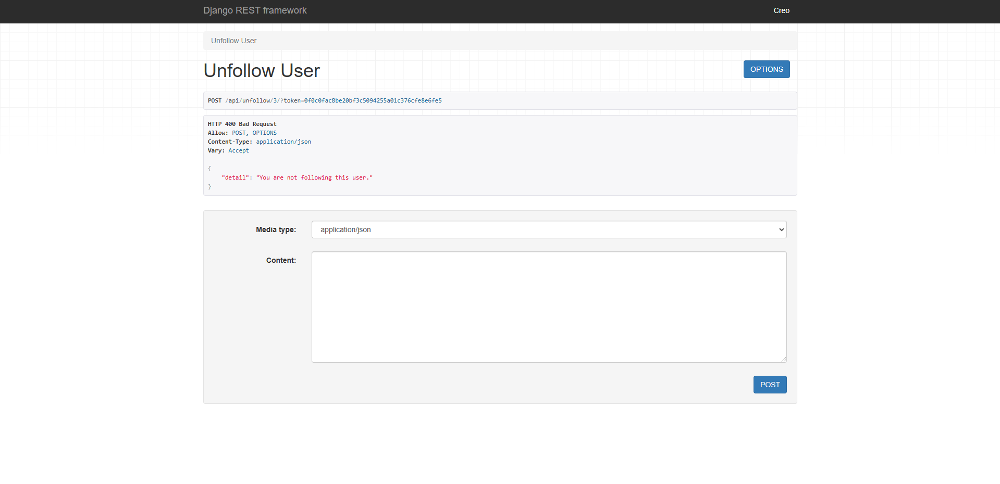
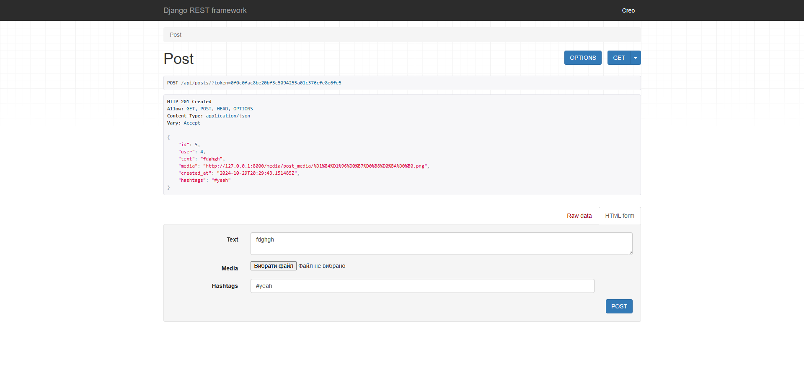
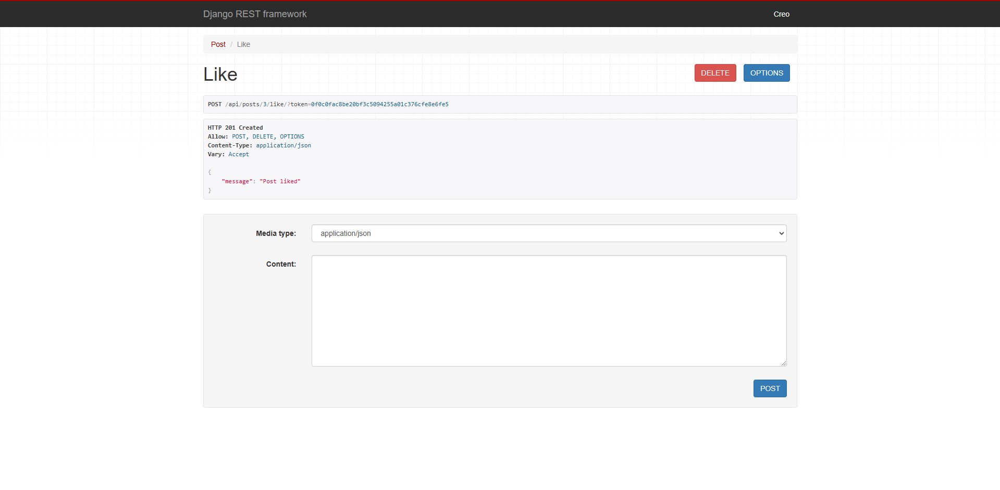
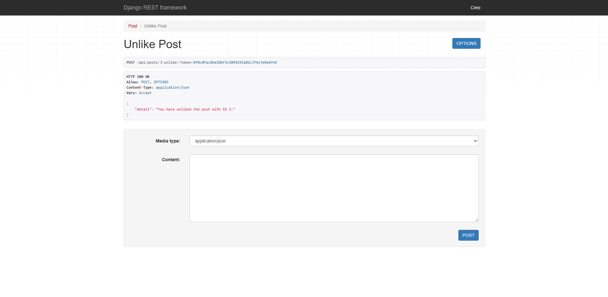
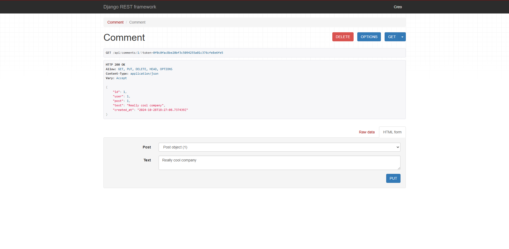
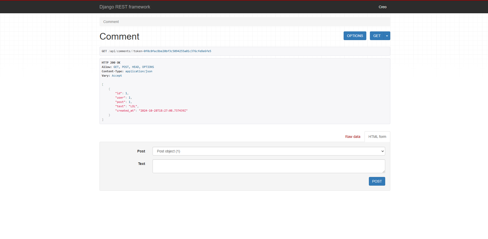

# Social Media API

A Django REST API for a social media platform that includes core functionality such as user registration, profile management, following/unfollowing users, creating posts, liking/unliking posts, and commenting on posts. 

---

## Table of Contents

- [General Purpose](#general-purpose)
- [Features](#features)
- [Technologies](#technologies)
- [Getting Started](#getting-started)
  - [Prerequisites](#prerequisites)
  - [Installation](#installation)
- [API Endpoints](#api-endpoints)
  - [User and Authentication Endpoints](#user-and-authentication-endpoints)
  - [User-Related Endpoints](#user-related-endpoints)
  - [Post-Related Endpoints](#post-related-endpoints)
  - [Comment-Related Endpoints](#comment-related-endpoints)
- [Screenshots](#screenshots)

---

## General Purpose

The Social Media API serves as a backend for a social media platform, providing secure access to a variety of social functionalities, from user registration to profile management and social engagement (such as following/unfollowing, posting, and commenting). Built with Django and Django REST Framework, it enables token-based authentication to secure user sessions, ensuring that users have a safe and reliable experience.

## Features

- **User Registration and Authentication**: Sign up and authenticate users with secure token-based authentication.
- **User Profile Management**: Manage user profiles with fields for additional information.
- **Follow/Unfollow Users**: Allow users to follow or unfollow each other to build a social network.
- **Post Creation and Retrieval**: Users can create, edit, retrieve, and delete posts.
- **Like/Unlike and Comment on Posts**: Users can interact with posts through likes and comments.

## Technologies

- **Backend**: Django and Django REST Framework for a powerful and scalable backend.
- **Database**: SQLite (default) - can be configured to PostgreSQL or MySQL.
- **Authentication**: Token-based authentication for securing API requests.

## Getting Started

### Prerequisites

- Python 3.x
- Django 5.x
- Django REST Framework

### Installation

1. **Clone the repository**:
    ```bash
    git clone https://github.com/your_username/social_media_API.git
    ```

2. **Set up a virtual environment**:
    ```bash
    python -m venv venv
    source venv/bin/activate  # On Windows use `venv\Scripts\activate`
    ```

3. **Install dependencies**:
    ```bash
    pip install -r requirements.txt
    ```

4. **Set up the database**:
    ```bash
    python manage.py migrate
    ```

5. **Create a superuser**:
    ```bash
    python manage.py createsuperuser
    ```

6. **Run the server**:
    ```bash
    python manage.py runserver
    ```

## API Endpoints

This API uses token-based authentication. To access user-specific resources, include the token in your request headers after obtaining it from the `/token/` endpoint.

### User and Authentication Endpoints

- **Register a New User**
  
  - **Endpoint**: `POST /register/`
  - **Description**: Creates a new user account by providing credentials like username, email, and password. 
  - **Example**: A user can register to the platform by entering their desired username, email, and password. Upon successful registration, they receive a confirmation response.

- **Obtain Authentication Token**
  
  - **Endpoint**: `POST /token/`
  - **Description**: Allows users to retrieve an authentication token after providing their username and password.
  - **Example**: After registering, a user can login with their credentials to get a unique token. This token is required for accessing protected resources.

### User-Related Endpoints

These endpoints enable user interactions within the social media platform.

- **List All Users**
  
  - **Endpoint**: `GET /api/users/`
  - **Description**: Retrieves a list of all registered users on the platform.
  - **Example**: Users can view all registered members on the platform, which can help with discovering other users to follow.

- **Get List of Followers**
  
  - **Endpoint**: `GET /api/followers/`
  - **Description**: Displays a list of all users who are following the authenticated user.
  - **Example**: This endpoint allows users to see who is following them, providing insights into their social network.

- **Follow a User**
  
  - **Endpoint**: `POST /api/follow/<user_id>/`
  - **Description**: Follows a user specified by the `user_id`.
  - **Example**: By specifying another user's ID, a user can follow them, adding them to their social network.

- **Unfollow a User**
  
  - **Endpoint**: `POST /api/unfollow/<user_id>/`
  - **Description**: Unfollows the user identified by `user_id`.
  - **Example**: A user can unfollow another user to remove them from their following list.

### Post-Related Endpoints

Endpoints for creating and managing posts within the platform.

- **List All Posts**
  
  - **Endpoint**: `GET /api/posts/`
  - **Description**: Retrieves a list of all posts made by users.
  - **Example**: Users can view all posts from the community to keep up with recent updates and content.

- **Create a New Post**
  - **Endpoint**: `POST /api/posts/`
  - **Description**: Allows the authenticated user to create a new post.
  - **Example**: Users can share their thoughts or media content by creating new posts.

- **Like a Post**
  
  - **Endpoint**: `POST /api/posts/<post_id>/like/`
  - **Description**: Likes a post identified by `post_id`.
  - **Example**: Users can show appreciation for a post by liking it.

- **Unlike a Post**
  
  - **Endpoint**: `POST /api/posts/<post_id>/unlike/`
  - **Description**: Unlikes the post specified by `post_id`.
  - **Example**: If a user no longer wants to like a post, they can undo it.

### Comment-Related Endpoints

These endpoints provide comment functionality for posts.

- **List All Comments**
  
  - **Endpoint**: `GET /api/comments/`
  - **Description**: Retrieves a list of all comments on posts.
  - **Example**: View all user comments to stay informed on discussions within posts.

- **Create a New Comment**
  - **Endpoint**: `POST /api/comments/`
  - **Description**: Adds a new comment on a specified post by the authenticated user.
  - **Example**: Users can engage with posts by commenting.

- **Retrieve, Update, or Delete a Comment**
  
  - **Endpoint**: 
    - `GET /api/comments/<comment_id>/` - Retrieve a specific comment.
    - `PUT /api/comments/<comment_id>/` - Update a specific comment.
    - `DELETE /api/comments/<comment_id>/` - Delete a specific comment.
  - **Example**: Users can edit or remove their comments, or view individual comment details.

## Screenshots

The `screens` folder contains images of each endpoint and functionality.


