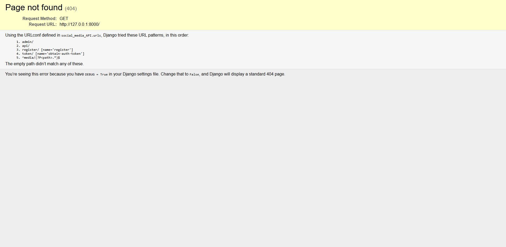

# Social Media API

A Django REST API for a social media platform that includes functionality for user registration, profile management, following/unfollowing users, creating posts, liking/unliking posts, and commenting.

## Features

- **User Registration and Authentication**
- **User Profile Management**
- **Follow/Unfollow Users**
- **Post Creation and Retrieval**
- **Like/Unlike and Comment on Posts**

## Technologies

- **Django** and **Django REST Framework** for the backend.
- **Token-based authentication** for secure access.

## Getting Started

### Prerequisites

- Python 3.x
- Django 5.x
- Django REST Framework

### Installation

1. **Clone the repository**:
    ```bash
    git clone https://github.com/your-username/social-media-api.git
    cd social-media-api
    ```

2. **Set up a virtual environment**:
    ```bash
    python -m venv venv
    source venv/bin/activate  # On Windows use `venv\Scripts\activate`
    ```

3. **Install dependencies**:
    ```bash
    pip install -r requirements.txt
    ```

4. **Set up the database**:
    ```bash
    python manage.py migrate
    ```

5. **Create a superuser**:
    ```bash
    python manage.py createsuperuser
    ```

6. **Run the server**:
    ```bash
    python manage.py runserver
    ```


# API Endpoints

## User and Authentication Endpoints

- **Register a New User**


  - **Endpoint**: `POST /register/`
  - **Description**: Registers a new user with provided credentials (e.g., username, password, email).
  
- **Obtain Authentication Token**

  - **Endpoint**: `POST /token/`
  - **Description**: Provides an authentication token for the user after verifying username and password.
## api/ page


## User-Related Endpoints

- **List All Users**

  - **Endpoint**: `GET /api/users/`
  - **Description**: Retrieves a list of all registered users.
  
- **Get List of Followers**
  - **Endpoint**: `GET /api/followers/`
  - **Description**: Returns a list of users who follow the authenticated user.

- **Follow a User**
  - **Endpoint**: `POST /api/follow/<user_id>/`
  - **Description**: Follows the user specified by `user_id`. Requires authentication.
  
- **Unfollow a User**
  - **Endpoint**: `POST /api/unfollow/<user_id>/`
  - **Description**: Unfollows the user specified by `user_id`. Requires authentication.

## Post-Related Endpoints

- **List All Posts**
  - **Endpoint**: `GET /api/posts/`
  - **Description**: Retrieves a list of all posts created by users.

- **Create a New Post**
  - **Endpoint**: `POST /api/posts/`
  - **Description**: Creates a new post by the authenticated user.

- **Like a Post**
  - **Endpoint**: `POST /api/posts/<post_id>/like/`
  - **Description**: Likes the post specified by `post_id` for the authenticated user.

- **Unlike a Post**
  - **Endpoint**: `POST /api/posts/<post_id>/unlike/`
  - **Description**: Unlikes the post specified by `post_id` for the authenticated user.

## Comment-Related Endpoints

- **List All Comments**
  - **Endpoint**: `GET /api/comments/`
  - **Description**: Retrieves a list of all comments on posts.

- **Create a New Comment**
  - **Endpoint**: `POST /api/comments/`
  - **Description**: Creates a new comment on a post by the authenticated user.

- **Retrieve, Update, or Delete a Comment**
  - **Endpoint**: 
    - `GET /api/comments/<comment_id>/` - Retrieve a specific comment.
    - `PUT /api/comments/<comment_id>/` - Update a specific comment.
    - `DELETE /api/comments/<comment_id>/` - Delete a specific comment.
  - **Description**: Retrieves, updates, or deletes the comment specified by `comment_id`.

---

Each endpoint requires authentication via a token provided by the `/token/` endpoint, which should be included in the header of your requests for accessing user-specific resources.